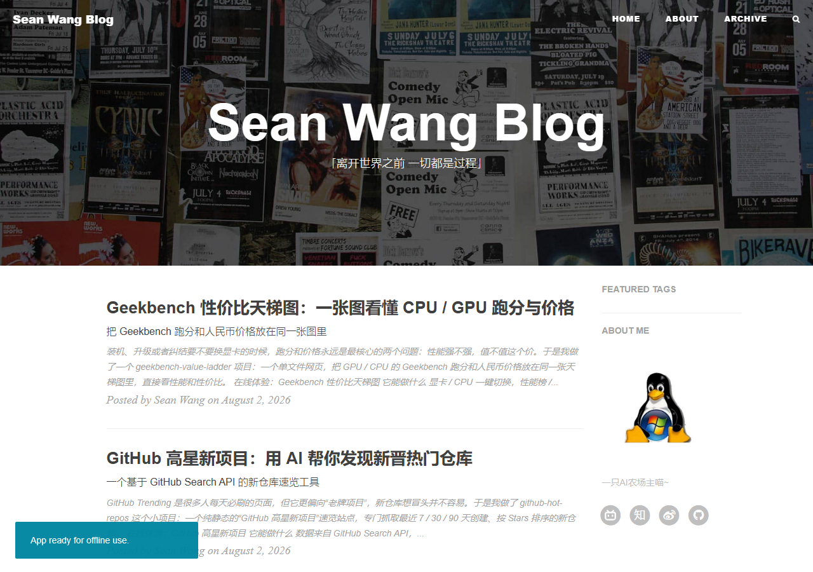

# Sean Wang 的个人博客

「离开世界之前 一切都是过程」

这是 Sean Wang（WSL）的个人博客，记录一个 AI 农场主在 AI、工具、硬件和装机场上的折腾日常。文章曾散落于 Nothing、Rubbish、Nothure、Silence 等平台，现在集中归档在这里。

## 在线访问

博客地址：<https://seanwang114514.github.io/>

## 首页截图



## 博客内容

- **AI**：与 DeepSeek、mimo、Qwen 等模型的日常切磋与使用心得
- **工具**：自己动手做的各种小项目，例如 GitHub 高星新项目速览工具
- **硬件 / 装机**：CPU、GPU、Geekbench 跑分与性价比分析，例如 Geekbench 性价比天梯图
- **随笔**：关于「把日子过得不浪费」的零碎记录

当前文章归档：

- [Geekbench 性价比天梯图：一张图看懂 CPU / GPU 跑分与价格](https://seanwang114514.github.io/geekbench-value-ladder/)
- [GitHub 高星新项目：用 AI 帮你发现新晋热门仓库](https://seanwang114514.github.io/github-hot-repos/)

## 技术栈

博客基于 [Hux Blog](https://github.com/Huxpro/huxblog-boilerplate) Jekyll 主题构建：

- Jekyll + Liquid 模板（`_includes/`、`_layouts/`）
- Ruby + Bundler 依赖管理
- Grunt 构建任务：压缩 JavaScript、编译 Less 到 CSS、监听文件变化等
- Rouge 代码语法高亮（兼容 Pygments 主题）

## 本地开发

环境要求：Ruby 和 Bundler。

```bash
git clone https://github.com/SeanWang114514/SeanWang114514.github.io.git
cd SeanWang114514.github.io
bundle install
bundle exec jekyll serve
```

默认访问 <http://localhost:4000>，也可以使用 `npm start` 启动。

修改主题样式时，编辑 `highlight.less` 等 Less 源文件，再通过 Grunt 编译：

```bash
npm install
grunt
```

## License

Apache License 2.0。Copyright (c) 2015-present Huxpro。

Hux Blog 衍生自 Clean Blog Jekyll Theme（MIT License），Copyright (c) 2013-2016 Blackrock Digital LLC。
